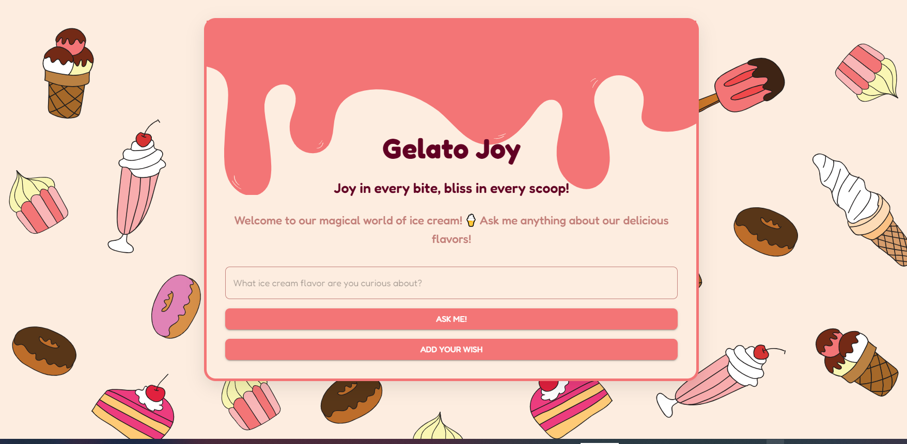

# Gelato Joy



**Gelato Joy** is a friendly AI assistant designed to enhance your experience at the ice cream shop. Whether you're curious about different flavors or want to add your ice cream wish, Gelato Joy is here to help!

## 🛠️ Technologies Used

- **Next.js**: A powerful React framework for building fast and user-friendly web applications.
- **FastAPI**: A modern web framework for building APIs with Python, ensuring high performance.
- **Hugging Face AI API**: Provides the AI capabilities to generate responses and recommendations for users.
- **Pinecone**: Manages vector embeddings for efficient and scalable AI queries.
- **Material-UI (MUI)**: Ensures a beautiful and consistent design throughout the application.

## 🚀 Features

- **AI-Powered Assistant**: Ask Gelato Joy anything about your favorite ice cream flavors, and get quick, accurate responses.
- **Ice Cream Wish List**: Add your own ice cream wish through a user-friendly form.
- **Interactive UI**: Enjoy a beautifully designed and responsive interface.

## 🔧 Setup and Installation

### 1. Install and run Frontend Dependencies

```
cd FE
npm install
npm run dev
```

### 2. Install and run Backend Dependencies

```
cd BE
pip install -r requirements.txt
uvicorn main:app --reload
```

### 3. Configure Environment Variables

```
- Frontend: Create a .env.local file in the FE folder and add the NEXT_PUBLIC_BACKEND_URL variable with the URL of your backend.

- Backend: Create a .env file in the BE folder with your API keys and other necessary settings.
```

## 📄 License

[Creative Commons License](https://creativecommons.org/licenses/by-nc-sa/4.0/legalcode)